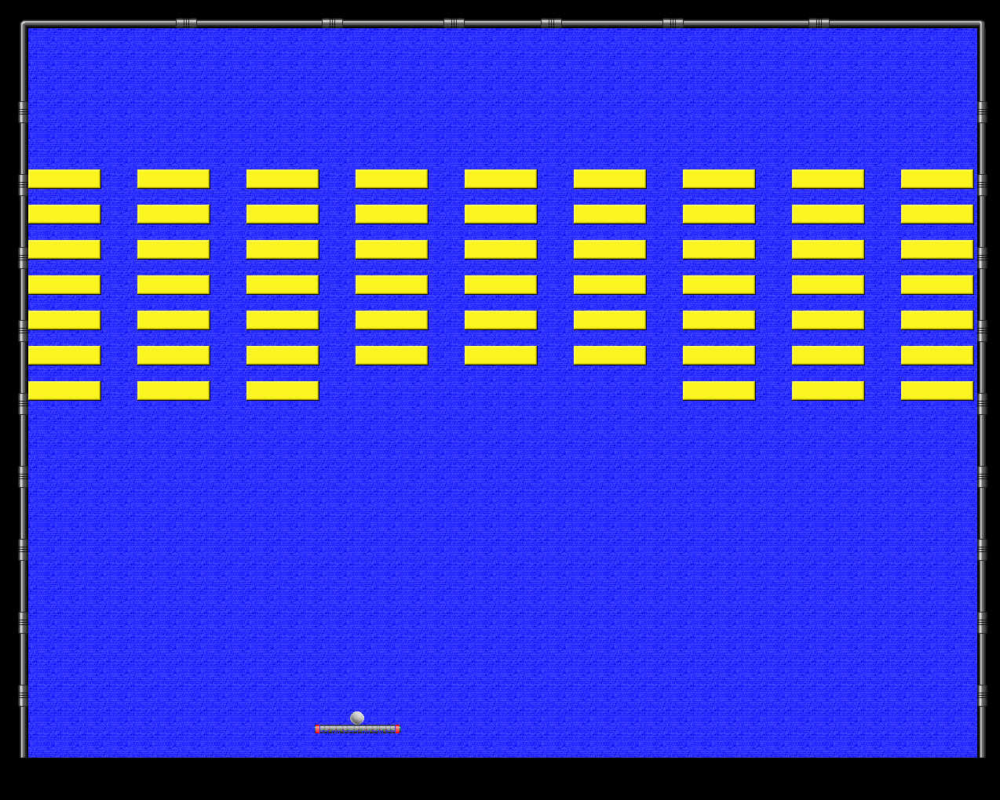
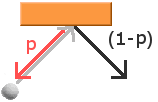
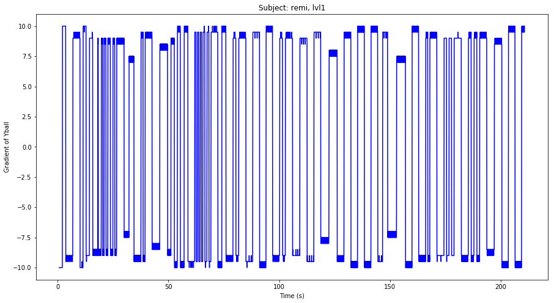
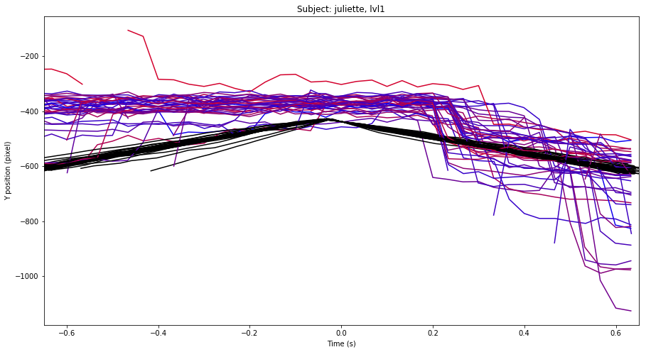
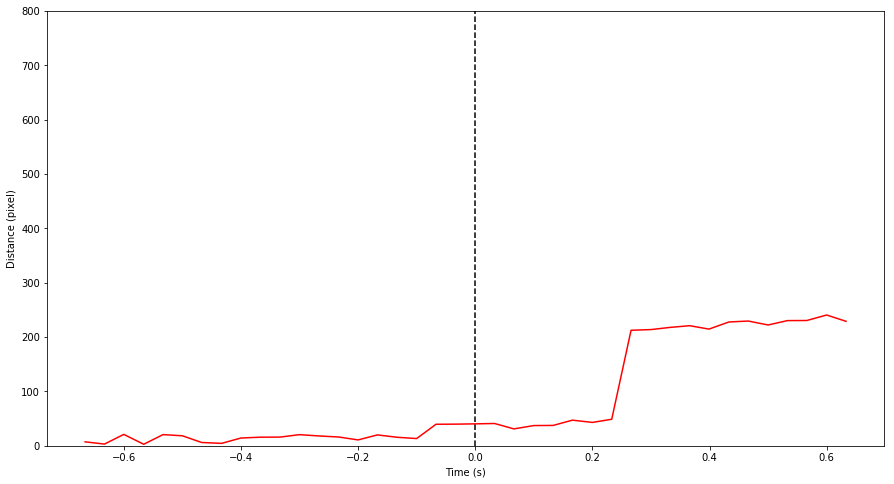
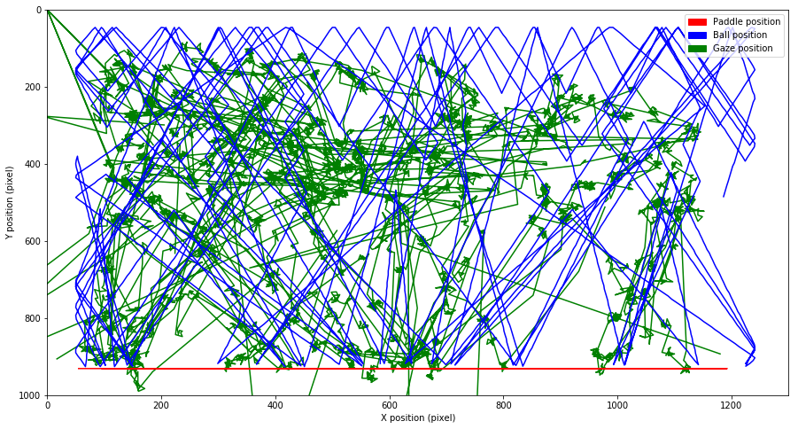
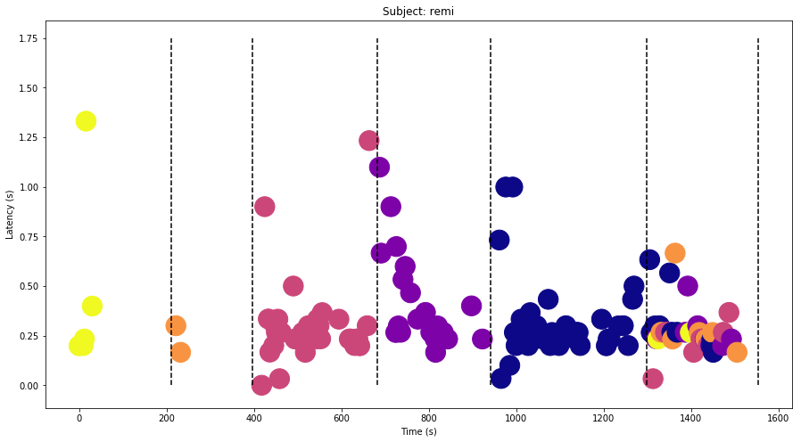
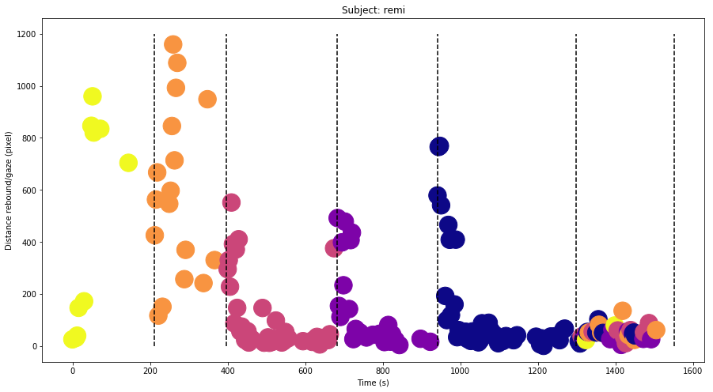

# Exploration du codage prédictif grâce au jeu vidéo

<big>**Thys Giaccone**</big> - Master 2 OPSI - Signal et Image  
**Encadrants : Bruno Wicker, Laurent Perrinet**  
*Laboratoire de Neurosciences Cognitives, Equipe ACDC, UMR 7291 CNRS  
Aix-Marseille-Université - 3, place Victor-Hugo 13331 - Marseille*  
*Institut de Neurosciences de la Timone  
Faculté de Médecine - 27, boulevard Jean Moulin 13005 - Marseille*
*Ecole Centrale Marseille, Technopôle de Château-Gombert  
38, rue Frédéric Joliot Curie 13451 - Marseille*
___

**Résumé:** Dans ce mémoire nous étudions l'influence du contexte perceptuel sur les mécanismes de prise de décision. En développant un outil flexible et écologique, le jeu vidéo, nous ouvrons la possibilité d'étudier le rôle d'un apprentissage probabiliste de type prédictif et son implication dans une tâche de prise de décision à partir d'éléments perceptuels ambigüs. Cet outil, conçu pour être aisément configurable et modifiable, pourra être utilisé dans d'autres recherches dans le contexte d'une théorie du cerveau prédictif et, par exemple, permettre l'étude de l'influence d'une valence sociale chez des individus atteints de troubles du spectre autistique.
___

## 1. Introduction

La capacité à générer des prédictions est cruciale pour des systèmes adaptatifs et intelligents. L’hypothèse du cerveau prédictif postule que notre cerveau infère, à partir des entrées sensorielles, un modèle interne du monde extérieur. À son tour, ce modèle interne peut être utilisé pour créer des anticipations sur les entrées sensorielles. L’hypothèse du codage prédictif suppose que le cerveau génère en permanence de telles anticipations en utilisant une représentation interne de surprise ou d’erreur lorsque ces prédictions sont violées par des entrées sensorielles inattendues. En se basant sur ce concept, l'intérêt de nos recherches est de réussir à construire un outil permettant d'explorer la prise de décision dans un environnement variable (probabiliste) et ainsi étudier les interactions entre perception et action, l'inférence active.

Considérant que nos perceptions sont testées afin de confirmer les hypothèses générées par le cerveau, on peut alors interpréter la recherche visuelle comme une expérience générant des données sensorielles. Les données ainsi acquises sont utilisées par le cerveau dans sa génération de prédictions. De nombreuses études font le lien entre notre contrôle du regard et les prédictions ainsi générées (*Karl Friston et al.* 2012, *John M. Henderson et al.* 2017). Le mouvement des yeux, informant sur l'emplacement du foyer attentionnel, est directement lié à la recherche d'informations nécessaires aux prédictions. Nous nous sommes également basés sur les travaux de *Karl Friston et al.* (2012) quant au comportement saccadique du regard qui renseigne sur la génération de prédictions. L'idée étant que le regard, contrôlé par le cerveau, cherche à minimiser une mesure de l'entropie des états cachés du monde (l'énergie libre) et de leurs conséquences sensorielles. On peut ainsi modéliser ce fonctionnement en utilisant l'inférence Bayesienne ainsi qu'une minimisation de l'énergie libre (*Karl Friston et al.* 2006). De ce fait, on peut déterminer un modèle d'inférence perceptuelle et d'apprentissage qui pourrait expliquer un grand nombre de faits neurobiologiques. En usant d'outils de physique statistique, tel qu'une méthode variationnelle Bayesienne et des modèles hiérarchiques décrivant la génération des données sensorielles - ceux-ci permettant au cerveau la construction de priors prévisionnels dynamiques et sensibles au contexte - on peut mettre en évidence le lien entre perception et action. Ce modèle d'*inférence active* étend le modèle de codage prédictif au champ du contrôle comportemental (*Karl Friston et al.* 2011).

L'utilisation d'un jeu vidéo pour mener cette étude, nous est suggérée par de nombreuses publications scientifiques - comme celles de *Daphne Bavelier et al.* (2012 et 2013) - qui nous démontre l'intérêt de l'utilisation de tels paradigmes expérimentaux pour ce qui est de l'apprentissage et de l'attention. L'utilisation d'un jeu vidéo nous permet d'avoir un environnement écologique et ludique, permettant notamment l'étude de populations de différents âges dont la mâturation du cerveau prédictif peut varier, et permettant également de mettre en évidence des dysfonctionnements si jamais ils sont appliqués à des observateurs qui révèlent des desordres pathologiques. L’intérêt particulier du jeu video dans notre projet est la capacité de pouvoir connaître et manipuler facilement la structure statistique de l’environnement. L'intérêt d'un jeu vidéo ne s'arrête pas là. Une fois développé, le jeu peut être modifié, amélioré, afin de pouvoir être appliqué à des recherches différentes. La flexibilité du jeu vidéo et la possibilité de controler divers paramètres en fait un outil d'une efficacité certaine, permettant un grand nombre d'applications.  

C'est donc à partir de ces considérations que l'idée d'étudier le cerveau prédictif à l'aide du jeu vidéo a vu le jour. L'intérêt de cette étude étant à terme de réussir à modéliser le fonctionnement du cerveau prédictif à l'aide d'outils de traitement du signal tels que des modèles Bayesiens d'inférence active et ainsi soutenir, voire confirmer, cette théorie du cerveau prédictif. Plusieurs objectifs ont donc été fixés afin de mener cette étude. Tout d'abord, il fallait définir le protocole expérimental - c'est-à-dire programmer le jeu - qui permettra de mettre en évidence l'apprentissage et la génération de prédictions. Le choix du langage - Python - nous a été dicté par sa grande utilisation dans le monde scientifique, nous permettant de profiter de l'expérience de la communauté, et par la puissance et la flexibilité de ce langage orienté objet. De plus, Python possède un module dédié au développement de jeux vidéos - ``Pygame`` - qui rend notre choix plus évident encore.  

Le jeu ainsi programmé devra répondre à plusieurs critères afin qu'il permette, suite à l'analyse des données obtenues, de répondre à la problématique. Le jeu va donc jouer avec un contexte probabiliste et permettre un apprentissage de celui-ci par le sujet au long de la partie. Il va également permettre aux expérimentateurs d'acquérir les données et les stocker dans des fichiers spécifiques. Comme expliqué précédemment, le regard du joueur nous permet de déterminer la génération de prédiction du cerveau. C'est grâce à un système de suivi du regard (*eye-tracking*), interfacé avec le jeu au préalable, que nous récupérons cette information.  

Une fois les données acquises, l'objectif est de créer un programme complet qui permettra une analyse rapide et facile des données futures. Celui-ci sera capable de lire les fichiers de données, de tracer les figures pertinentes, de mettre en évidence les variables d'intérêts et ainsi fournir à l'expérimentateur les données nécessaires à la résolution de la problématique.  

Une fois cet outil - le jeu et le système d'enregistrement de données adapté - développé, ce sera la première étape vers une étude plus large visant à étudier l'influence d'une valence sociale dans le contexte du cerveau prédictif.  

## 2. Matériel et méthodes

Mon stage au Laboratoire de Neurosciences Cognitives, sous la supervision de Bruno Wicker, a débuté par une étape de revue bibliographique durant laquelle j'ai lu les articles scientifiques principaux traitant des sujets sur lesquels se base notre étude, comme le jeu vidéo (*Daphne Bavelier et al.*, 2012; 2013), le lien entre regard et prédiction du cerveau (*John M. Henderson*, 2017), l'inférence active, le codage prédictif et l'utilisation de traitements Bayesiens sous différentes formes (*Karl Friston et al.*, 2006; 2011; 2012; *Benjamin T. Vincent et al.*, 2015; *Florent Meyniel et al.*, 2016) comme son application aux troubles du spectre autistique (*Colin Palmer et al.*, 2017; *Meltem Sevgi et al.*, 2015). Une fois le sujet pris en main et après avoir clarifié nos objectifs, je suis entré dans la phase de programmation du jeu durant laquelle j'ai appris à coder en Python et notamment à utiliser le module Pygame. La dernière partie de mon stage s'est déroulée à l'Institut des Neurosciences de la Timone, sous la supervision de Laurent Perrinet, afin d'analyser les données recueillies.  

**Calendrier du stage**  
* Premier mois de stage : *documentation, bibliographie*  
* Second et troisième mois et demi de stage : *programmation du jeu et enregistrement des pilotes*  
* Deux dernières semaines de stage : *analyse des données*  

### 2.1 Programmation du jeu

Le jeu est un "casse-briques" classique (Fig. 1), programmé en langage Python à l'aide du module ``Pygame`` - module permettant le développement de jeux vidéos. La fenêtre du jeu fait 1024 pixels de haut pour 1280 pixels de large.  

Figure 1 : *Capture d'écran du niveau 1 du jeu*  

La raquette du casse-brique est dirigée grâce à la souris et permet de ré-orienter la balle, quelque soit son angle d'arrivée sur la raquette. Une balle arrivant au centre de la raquette est renvoyée en angle droit (à 90° par rapport à la raquette), tandis que les extrémités gauche et droite de la raquette vont renvoyer la balle avec des angles de respectivement 40° et 140°. Les valeurs intermédiaires suivent une loi linéaire respectant les valeurs données ci-dessus.  

Le contexte probabiliste est généré par une variable cachée associée à la couleur de la brique concernée qui va modifier le comportement de la balle lors de la destruction d'une brique selon une probabilité. La balle va alors avoir une probabilité **(1-p)** de rebondir normalement - c'est à dire symétriquement - sur la brique (Fig. 2, trajectoire gris-noir) et une probabilité **p** de revenir sur sa trajectoire (Fig. 2, trajectoire gris-rouge).  

Figure 2 : *Comportement de la balle lors d'un rebond sur une brique*
  

Il existe cinq couleurs de briques réparties dans un total de six niveaux. Les niveaux sont construits de la manière suivante :
 - niveau 1 : 60 briques de probabilité **p = 0**
 - niveau 2 : 60 briques de probabilité **p = 0.25**
 - niveau 3 : 60 briques de probabilité **p = 0.5**
 - niveau 4 : 60 briques de probabilité **p = 0.75**
 - niveau 5 : 60 briques de probabilité **p = 1**
 - niveau 6 : 80 briques mélangées aléatoirement contenant 16 briques de chaque probabilité

Afin de faciliter l'apprentissage, la couleur des briques provient d'une colormap isoluminante (PLASMA), et les probabilités **p** leur sont associées de la manière suivante :
 - briques **jaunes** : **p = 0**  
 - briques **oranges** : **p = 0.25**  
 - briques **saumons** : **p = 0.5**  
 - briques **violettes** : **p = 0.75**  
 - briques **bleues** : **p = 1**  

Nous avons donc des briques complètement prédictibles (**p = 0** et **p = 1**) sur lesquelles la balle rebondit toujours normalement ou revient toujours sur sa trajectoire, des briques fortement prédictibles (**p = 0.25** et **p = 0.75**) et des briques impossibles à prédire (**p = 0.5**).

#### La programmation au service de l'expérience

Il faut savoir que le jeu ne consiste pas uniquement en un casque-briques probabiliste. L'objectif étant d'avoir un programme complet mais aussi flexible, nous avons choisi d'utiliser un fichier de configuration - ``config.ini`` - qui permet de modifier facilement les valeurs suivantes :
 - vitesse de la balle  
 - taille de la balle  
 - dimensions de l'écran de jeu  
 - taille des briques  
 - configuration des niveaux  
 - angles de rebond sur la raquette  
 - nom du sujet qui passe l'expérience  

D'autres configurations ont été explorées, et il est également possible de modifier l'apparence des briques et du fond (background) du jeu - et ainsi pouvoir par exemple jouer sur une valence sociale en affichant des visages expressifs - ainsi que mettre en place des occulteurs faisant disparaître la balle sur une surface pré-définie, permettant d'étudier la volatilité du contexte et son influence sur la prise de décision et la génération de prédiction.  

Afin de motiver les sujets et les pousser à maintenir un comportement productif durant l'expérience, des phrases d'encouragement (``Super ! Continue comme ça !``) et de reproche (``Fais attention à ne pas perdre la balle.`` lors de la première perte de balle puis ``Fais plus attention !`` lors des pertes suivantes) sont affichées à l'écran lorsque le joueur finit un niveau ou perd la balle, respectivement.  

L'intégration d'un menu principal configurable permet de futurs ajouts de contenu comme, par exemple, un menu pour sélectionner différents sets de niveaux ou un menu d'options permettant de modifier ``config.ini`` directement dans le menu principal. Celui-ci contient actuellement deux options qui permettent de lancer la partie et quitter le jeu.  

Pour regrouper toutes les données dans un unique fichier, nous avons opté pour l'utilisation du format de données ``Pandas Dataframe`` - un module permettant de stocker un grand nombre de données facilement et efficacement.  

Afin que le programme du jeu puisse fonctionner de concert avec le dispositif d'eye-tracking, nous nous sommes munis d'un code d'interfaçage ``TheEyeTribe/Python`` écrit par *Per Baekgaard* sur son dépôt GitHub (https://github.com/baekgaard/peyetribe) et dont la licence est libre d'utilisation. Il a ensuite fallu intégrer le code à notre programme de manière à récolter les données de mouvements des yeux.  

Le programme enregistre les données de mouvement du regard, et le déplacement de la balle et de la raquette. Des parties de code permettent de stocker les données acquises pour les réunir dans une dataframe.  
Le code est disponible sur GitHub (https://github.com/Syht/StochPong), ce qui nous a permis d'utiliser des méthodes agiles pour construire et tester le code.

### 2.2 TheEyeTribe : dispositif d'eye-tracking

La récolte des données du regard est faite avec TheEyeTribe, un appareil d'eye-tracking - ou d'oculométrie - à notre disposition. Constitué de diodes infrarouges et d'une caméra infrarouge, ce dispositif permet, comme son nom l'indique, de traquer les mouvements oculaires et ainsi calculer la direction du regard du sujet. L'appareil utilisé fonctionne avec la technique de reflet cornéen - ou réflexion IR - qui consiste à l'envoi d'une lumière infrarouge en direction de la pupille pour que le reflet infrarouge renvoyé par la cornée de l'oeil soit ensuite détecté par la caméra infrarouge, permettant de déterminer la direction du regard.  

L'eye-tracker est positionné sous l'écran de jeu et est calibré à l'aide du logiciel natif *EyeTribe UI*. TheEyeTribe, considéré comme un système d'eye-tracking low-cost, ne présente pas pour autant de mauvaises performances, comme le confirme le papier de *Kristien Ooms et al.* (2015), tant que l'on impose de conditions expérimentales contrôlées : le sujet doit rester relativement immobile à une distance fixe du dispositif.

### 2.3 Protocole expérimental

Aucune information sur la nature probabiliste des briques n'est donnée au sujet ni sur le nombre de niveaux que comporte le jeu. On explique au joueur qu'il va devoir finir un certain nombre de niveaux en détruisant les briques que composent chacun d'entre eux. Avant de commencer l'expérience, le joueur s'installe devant l'écran sous lequel est placé le dispositif d'eye-tracking, à une distance d'environ 50 cm. On demande ensuite au joueur de rester le plus immobile possible durant l'étape de calibration et l'expérience afin que la précision de l'eye-tracker soit optimisée.  

L'étape de calibration consiste en la fixation et au suivi, par le sujet, d'un point qui apparait à l'écran puis se déplace en 16 endroits différents, marquant un arrêt d'environ une seconde à chaque emplacement. Si le sujet a correctement suivi le point des yeux, le logiciel confirme la qualité de la calibration et l'étape est terminée. Dans le cas contraire, le logiciel indique une mauvaise calibration et le sujet la recommence alors.

Chaque niveau dure entre 2 et 4 min pour une durée de 12 à 24 min. Ce à quoi s'ajoute 1 à 3 min de calibrage pour une durée totale de l'expérience de 13 à 27 min. La durée de l'expérience varie ainsi car c'est l'adresse du joueur à ce jeu qui va déterminer à quelle vitesse celui-ci va réussir à détruire toutes les briques d'un niveau. Quant à la calibration, sa durée ne dépasse la minute uniquement s'il est nécessaire de la recommencer.

Le sujet se trouve dans une salle d'expérimentation épurée afin de ne pas perturber sa vision et il n'y a aucune interaction avec l'expérimentateur pendant le jeu.

### 2.4 Recueil des données

La bonne conception des lignes de code qui gèrent le recueil des données est primordiale. Les données étant des positions en abscisse et en ordonnée, il est obligatoire de leur associer une marque temporelle. Mais il faut également s'assurer que le pas d'acquisition est le même. Pour résumer, il faut que chaque variable soit enregistrée en quantité égale et que leur enregistrement se lance au même instant. Une partie importante de la programmation a donc été d'harmoniser l'enregistrement des données.  

Le recueil des données a ainsi posé plusieurs problèmes. Dans un premier temps, nous n'utilisions pas de ``dataframe`` et stockions les données dans des fichiers séparés. L'écriture se faisait en temps réel, pendant la partie du joueur. Mais rapidement, nous avons remarqué un ralentissement inconstant du jeu. L'écriture était trop gourmande et il a fallu optimiser le programme. Deux mesures, résolvant le problème, ont été mises en place :
 - l'utilisation de matrices pour stocker les données et ainsi éviter l'écriture de fichier durant le jeu,
 - l'utilisation de ``Pandas Dataframe`` afin de réunir toutes les données en un seul fichier.

Les dataframes (Fig. 3) ainsi créées sont constituées de toutes les données suivantes :
 - état de l'eye-tracker : **..PEG** s'il réussit à déterminer la direction du regard  
 - marque de temps du regard : **Tgaze** (s)  
 - position en X du regard : **Xgaze** (pixel)  
 - position en Y du regard : **Ygaze** (pixel)  
 - marque de temps de la balle : **Tball** (s)  
 - position en X de la balle : **Xball** (pixel)  
 - position en Y de la balle : **Yball** (pixel)  
 - marque de temps de la raquette : **Tpaddle** (s)  
 - position en X de la raquette : **Xpaddle** (pixel)  
 - position en Y de la raquette : **Ypaddle** (pixel)  

Figure 3 : *Capture d'écran d'une partie de dataframe*  

Le nom donné aux fichiers dataframes est également très important. Il permet un classement chronologique mais également de déterminer le niveau concerné ainsi que le sujet de l'expérience. Son format est le suivant :   ``année-mois-jour_heureminuteseconde_dataframe_lvlnuméroduniveau_sujet.csv``  
*Exemple :* ``2017-06-28_143211_dataframe_lvl4_remi.csv`` correspond à l'enregistrement du niveau 4 de Rémi qui a eut lieu le 28/06/2017 et a débuté à 14h32 et 11s.  

### 2.5 Analyse des données

L'analyse des données est faite en langage Python, en utilisant Jupyter Notebook - une application open-source web qui permet de créer et partager des documents contenant du code, des équations, des graphiques et du texte explicatif - afin de faciliter l'échange et avoir un environnement de travail flexible.  

Les données obtenues nous permettent d'observer le comportement du joueur vis-à-vis de son apprentissage des probabilités **p** de rebond opposé de la balle sur les briques en fonction de leur couleur. Afin de quantifier ce phénomène, il nous fallait trouver comment traiter nos données, comment mettre en évidence des variables d'intérêts. Les données brutes obtenues nous permettent de visualiser les trajectoires des variables de la ``dataframe`` (Fig. 7).  

Ces données n'étant pas directement exploitables, notre but premier était de déterminer quand s'opéraient les rebonds détruisant les briques. Notre objectif étant d'étudier le lien entre perception et action, nous avons décidé de nous concentrer sur les rebonds qui détruisent les briques par le bas, car étant les rebonds retournant vers la raquette et donc ceux nécessitant une action de la part du joueur. Afin de se faire, nous avons tracé l'évolution du gradient de **Yball** au cours du temps (Fig. 4). Celui-ci, en changeant de signe, nous renseigne sur un changement de direction de la balle selon l'axe des ordonnées. C'est ainsi qu'on détermine, lorsqu'un gradient négatif devient positif, les instants où la balle détruit une brique par le bas.  

Figure 4 : *Evolution du gradient de la variable Yball au cours du temps*  

Nous avons, par la suite, choisi deux variables d'intérêts qui nous permettrait de mettre en évidence l'apprentissage des probabilités et les prédictions qui en découleraient. La première est le **temps de latence** défini par la durée entre le rebond de la balle sur la brique et la saccade du regard (critère : ``diff[d(impact, regard)] > 30 pixels``) qui résulte d'une prise de décision générée par les prédictions du cerveau. Celle-ci n'est calculable que lorsque le sujet a son regard posé sur le point d'impact balle-brique (critère : ``d(impact, regard) < 200 pixels``) car s'il regarde ailleurs, nous ne pouvons pas relier la saccade à une prédiction de la trajectoire de la balle. Le temps de latence est un marqueur psychologique lié à la prédictibilité ; elle indique le moment où la décision est prise. Plus la décision est incertaine, plus on met du temps à accumuler des informations et on observe donc une augmentation du temps de latence.

Grâce au gradient, on peut afficher les comportements de la balle et du regard dans une fenêtre autour du rebond et ainsi mettre en évidence cette première variable d'intérêt (Fig. 5).  

Figure 5 : *Comportement du regard (dégradé bleu-rouge) selon l'axe Y et fonction du temps lors du rebond de la balle (noir) sur une brique*  

On peut observer en noir l'évolution de la position en ordonnées de la balle, et ce sur tous les rebonds du niveau correspondant, tandis que les tracés variant du bleu au rouge montre la position en ordonnées du regard - les tracés sont de couleurs différentes afin de faciliter l'appréhension visuelle.  

Afin de quantifier plus précisément la latence, nous avons tracé les courbes montrant l'évolution de la distance entre le point d'impact balle/brique et le regard au cours du temps (Fig. 6).  

Figure 6 : *Evolution de la distance entre le point d'impact et le regard au cours du temps*  

La seconde variable d'intérêt, bien que découlant d'un raisonnement différent, est directement corrélée à la première et permet la mise en évidence du même phénomène par un moyen détourné. Cette variable est la distance entre le regard et l'emplacement de l'impact sur la brique (Fig. 7). Elle est pertinente du fait que, plus un comportement est prédictible, plus le regard peut se permettre de se trouver ailleurs, de n'observer la balle qu'avec la vision périphérique. On s'attend donc à trouver de grandes distances lorsque le rebond est complètement prédictible mais au contraire de petites distances lorsque le comportement est imprédictible. Pour mettre en évidence cette variable d'intérêt il nous faut donc la tracer en fonction de la probabilité **p** de chaque brique et observer son évolution au cours du temps.

**Temps de latence** `` = t(saccade) - t(impact)``  
**Distance impact-regard** `` = d(impact, regard) = sqrt[(Xball[impact] - Xgaze[impact])² + (Yball[impact] - Ygaze[impact])²]``

## 3. Résultats

Pour l'obtention des données pilotes, trois sujets ont été enregistrés sur l'expérience. Une analyse statistique poussée n'est pas possible à cause de la quantité restreinte de données mais est prévue pour la suite. Les données brutes obtenues suite à l'enregistrement des pilotes (Fig. 7) peuvent être tracées afin de visualiser les différentes trajectoires décrites par nos trois variables.  

Figure 7 : *Trajectoires du regard, de la balle et de la raquette au cours d'un niveau*  

Une fois les rebonds détectés grâce au gradient (Fig. 4) et les variables d'intérêts calculées, nous les avons tracées de manière à mettre en évidence les effets d'apprentissage recherchés et la génération de prédictions qui en découle.  

### 3.1 Temps de latence

Les temps de latence ont été calculés pour chaque rebond de balle sur une brique lorsque le calcul est possible :  
d(impact, regard) < 200 pixels  

La probabilité **p** de la brique correspondante est indiquée par la couleur du point indiquant la valeur de latence.  
Rappelons que les couleurs sont reliées aux probabilités et que du niveau 1 au niveau 5 nous avons, dans l'ordre, des briques de probabilités **p = 0**, **p = 0.25**, **p = 0.5**, **p = 0.75** et **p = 1**, puis les 5 couleurs de brique mélangées en nombre égal pour le niveau 6.

Les latences sont affichées au cours du temps sur la totalité des 6 niveaux. Ainsi, les **lignes verticales pointillées** correspondent au passage d'un niveau au suivant.  

Figure 8 : *Evolution des latences de première saccade après le rebond au cours des six niveaux renseignée de la couleur de brique correspondante*  

### 3.2 Distance point d'impact - regard

Les distances impact-regard ont été calculées pour chaque rebond de balle sur une brique.

La probabilité **p** de la brique correspondante est indiquée par la couleur du point indiquant la valeur de latence.  
Rappelons que les couleurs sont reliées aux probabilités et que du niveau 1 au niveau 5 nous avons, dans l'ordre, des briques de probabilités **p = 0**, **p = 0.25**, **p = 0.5**, **p = 0.75** et **p = 1**, puis les 5 couleurs de brique mélangées en nombre égal pour le niveau 6.

Les distances impact-rebond sont affichées au cours du temps sur la totalité des 6 niveaux. Ainsi, les **lignes verticales pointillées** correspondent au passage d'un niveau au suivant.  

Figure 9 : *Evolution de la distance entre le point d'impact de la balle sur une brique et la position du regard renseignée de la couleur de brique correspondante*  

## 4. Discussion

**Elément important quant à la prédictibilité des briques :**  
Bien que les briques de probabilités **p = 0.25** et **p = 0.75** sont également prédictibles par le sujet, il faut prendre en compte une information *a priori* importante qui est le fait que le joueur s'attend toujours, intuitivement, à voir la balle rebondir normalement (symétriquement). De ce fait, lorsque l'on considère des briques de probabilité **p > 0.5**, l'apprentissage de celle-ci s'en trouve perturbé, ce qui explique pourquoi le joueur n'a pas le même comportement pour les briques de probabilité **p = 0.25** que pour celles de probabilité **p = 0.75**.  

**Temps de latence (Fig. 8) :**  
- **Niveau 1 (p = 0) :** On observe une faible quantité de donnée pour le niveau 1, ce qui rend l'interprétation des résultats difficiles. On peut néanmoins comprendre ce manque après réflexion ; les briques étant entièrement prédictibles pour le sujet, car se comportant comme lors d'un rebond réel et du fait de leur probabilité **p = 0**, le joueur peut alors se permettre de poser son regard ailleurs et utiliser sa vision périphérique pour traquer la balle.  
- **Niveau 2 (p = 0.25) :** De même, on observe une faible quantité de données pour le niveau 2. On peut, de la même manière, comprendre ce manque ; les briques ne se comportent de manière contre-intuitive que pour 25% des rebonds, le joueur peut alors se permettre de poser son regard ailleurs et utiliser sa vision périphérique pour traquer la balle.  
- **Niveau 3 (p = 0.5) :** On n'observe pas de tendance particulière pour le niveau 3. Contenant des briques imprédictibles, les temps de latence nous informe qu'il n'y a pas d'apprentissage.
- **Niveau 4 (p = 0.75) :** On observe des latences élevées au début du niveau 4, qui diminuent progressivement au fil du niveau. C'est le comportement typique auquel on s'attend ; le sujet a tout d'abord du mal à prédire le rebond car celui-ci prend 75% du temps une direction contre-intuitive, ce qui résulte en une grande latence. Le sujet apprend ensuite l'effet probabiliste et se met à prédire de mieux en mieux la direction de la balle, ce qui résulte en une baisse de la latence.  
- **Niveau 5 (p = 1) :** Pour le niveau 5, on observe un phénomène similaire au niveau 4 mais avec une "pente" beaucoup plus abrupte. Bien qu'on s'attendrait à obtenir des résultats similaire au niveau 1, car les briques **p = 0** et **p = 1** sont également prédictibles, on obtient au contraire une bonne quantité de données. Ce phénomène peut s'expliquer car la balle rebondit systématiquement de manière contre-intuitive ; le joueur en est perturbé et son attention est monopolisée. Il montre tout d'abord de fortes latences qui diminuent rapidement à cause de la forte prédictibilité des rebonds.  
- **Niveau 6 (toutes les couleurs) :** Pour le niveau 6, on observe des temps de latence faibles tout au long du niveau ; le joueur ayant appris les probabilités au cours des 5 niveaux précédents, il semble réussir à prédire correctement les rebonds, mettant en évidence l'apprentissage des probabilités. Quatre rebonds affichent des temps de latence supérieurs à la moyenne et trois d'entre eux sont des rebonds sur des briques à tendance contre-intuitive (deux briques **p = 1** et une brique **p = 0.75**). Ce qui semble corroboré le fait que les probabilités de rebonds contre-intuitifs sont plus difficile à apprendre par le joueur.

**Distance impact-regard (Fig. 9) :**  
- **Niveau 1 (p = 0) :** On observe de grandes distances, pour le niveau 1, dûes au fait que les briques sont entièrement prédictibles pour le sujet. Celui-ci peut alors se permettre de poser son regard ailleurs et utiliser sa vision périphérique pour traquer la balle.  
- **Niveau 2 (p = 0.25) :** De la même manière, on observe de grandes distances pour le niveau 2 ; comme les briques se comportent de manière contre-intuitive pour 25% des rebonds, le joueur peut se permettre de poser son regard ailleurs et utiliser sa vision périphérique pour traquer la balle. Un plus grand étalement des valeurs se fait quand même sentir, montrant que le sujet ressent la probabilité et se voit obligé de focaliser son attention sur les rebonds plus souvent que lors du niveau 1.  
- **Niveau 3 (p = 0.5) :** Dans le niveau 3, contenant les briques imprédictibles, on observe une tendance claire dans l'évolution des distances impact-regard au cours du temps. On observe d'abord de grandes distances qui diminuent rapidement pour enfin se stabiliser sur de très faibles distances. Cette courbe soutient le fait que le sujet se voit obligé de rapprocher son regard du point d'impact pour chercher l'information car il ne peut pas générer de prédiction correctement et ainsi user de sa vision périphérique pour suivre la balle.  
- **Niveau 4 (p = 0.75) :** Dans le niveau 4, on observe la même tendance dans l'évolution des distances impact-regard au cours du temps. On observe d'abord de grandes distances qui diminuent rapidement pour enfin se stabiliser sur de très faibles distances. Contrairement au niveau 2 (**p = 0.25**) le sujet se voit obligé de rapprocher son regard du point d'impact pour rechercher l'information car, malgré la prédictibilité identique, les rebonds sur les briques violettes (**p = 0.75**) prennent 75% du temps une direction contre-intuitive contrairement aux oranges qui prennent 75% du temps une direction intuitive.  
- **Niveau 5 (p = 1) :** On observe, dans le niveau 5, un phénomène similaire au niveau 4. Bien que les briques bleues sont parfaitements prédictibles, la balle rebondit systématiquement de manière contre-intuitive. Le joueur utilise d'abord sa vision périphérique pour ensuite rapprocher sont regard du point d'impact pour chercher l'information. On s'attendrait ici à ce que le joueur se mette à utiliser de nouveau sa vision périphérique une fois l'apprentissage de la probabilité acquis, mais il semble que le côté contre-intuitif des rebonds monopolise son attention et le force à regarder la zone d'intérêt.  
- **Niveau 6 (toutes les couleurs) :** On observe, dans le niveau 6, que le joueur maintient son regard proche pour tout type de brique et ce tout au long du niveau. On s'attendrait à observer des distances plus grandes pour les briques prédictibles que pour celles qui ne le sont pas. Le mélange des briques semble pousser le sujet à focaliser son attention sur les rebonds afin de générer les meilleurs prédictions possibles.  

Il est bon de remarquer que les deux variables d'intérêts nécessitent d'être analysées en parallèle ; l'une sans l'autre ne nous renseignant pas sur tous les aspects qui nous intéressent. En effet, les critères de calcul du temps de latence nous font perdre un certain nombre de données, ce qui n'est pas le cas pour la distance impact-regard. De plus, ce seccond critère nous renseigne sur l'utilisation de la vision périphérique, qui semble être un élément important dans les stratégies des joueurs et est indirectement liée à la facilité à générer des prédictions.

Nos hypothèses de départ n'avaient pas pris en compte un élément qui s'est révélé significatif, l'intuitivité des rebonds. En effet, l'apprentissage qui intervient au long de l'expérience est basée sur le modèle du monde extérieur déjà généré par le sujet. Un des priors qui constitue ce modèle est le simple fait que le rebond d'une balle sur une surface a une trajectoire de sortie symétrique à la trajectoire d'arrivée sur la surface. Ainsi, le joueur est influencé par ses propres attentes et son apprentissage des probabilité - donc sa génération de prédictions - en est perturbé. On observe ainsi une forte implication du sujet - le regard se porte sur la zone d'intérêt pour récupérer un maximum d'informations - pour les fortes probabilité (**p = 0.75** et **p = 1**) ainsi qu'un apprentissage actif, tandis que pour les faibles probabilités (**p = 0** et **p = 0.25**) le sujet semble utiliser un modèle pré-existant du monde extérieur et délaisser l'apprentissage. L'apprentissage du sujet semble être également influencé lorsque les rebonds sont imprédictibles (**p = 0.5**) et lorsque les rebonds ont de fortes probabilités (**p = 0.75** et **p = 1**) d'être contre-intuitifs.

**Limites**  

L'étude présentée dans ce mémoire n'est qu'à ses prémices ; nous avons ainsi été confrontés à des limitations induites par un manque de temps. Notre étude n'a pour l'instant qu'une faible quantité de données exploitables, tout d'abord dûe au nombre restreint de pilotes - trois personnes ont été enregistrées sur l'expérience - puis à une simplification (expliquée dans **2.5 Analyse des données**) qui fait que nous ne considérons que les rebonds qui viennent par le bas de la brique. De ce fait, il n'a pas été possible de faire une analyse statistique poussée afin de montrer des résultats solides. Cette étude statistique est prévue pour la suite, lorsqu'un bon nombre de sujets auront procédé à l'expérience.  

Contrairement aux prévisions faites en début de stage, nous n'avons pas eu le temps d'analyser les données de la raquette. Les déplacements de la raquette sont censées refléter la prise de décision du sujet et il serait intéressant d'observer le lien entre celle-ci et les déplacements de la balle et du regard. Il est ainsi prévue de mettre en évidence le lien entre perception et action en analysant la corrélation entre la génération de prédiction du sujet et sa prise de décision, se reflétant dans le mouvement de la raquette.

?? Les faibles temps d'acquisition - soient les durées des niveaux - pourraient ne pas être suffisant pour observer correctement l'apprentissage des probabilités. Il ne faut pas pour autant ignorer le fait qu'une expérience trop longue pourrait nuire à la concentration des sujets et ainsi résulter en de mauvaises données. ?? **TODO : Ce paragraphe est-il pertinent ? -Laurent trouve que si :-)**

Comme expliqué précédemment, un certain nombre de données de latence est perdu dûe au fait que les joueurs ne regardaient pas suffisamment près de l'impact sur la brique. Le calcul de la latence est alors rendu impossible à cause du critère : ``d(impact, regard) < 200  pixels``.
Nous avons donc envisagé différentes modifications futures du jeu afin d'améliorer la quantité de résultats ; l'objectif étant de forcer le joueur à regarder la zone d'intérêt, nous avons pensé à utiliser des occulteurs cachant une partie de l'écran tout en laissant une autre partie visible. Deux types d'occlusions nous ont paru pertinents :  
- un disque d'occlusion lié au système d'eye-tracking, permettant de cacher la totalité de l'écran au joueur, à l'exception d'un disque d'environ 200 pixels de rayon centré au centre du regard du joueur,
- un rectangle vertical d'occlusion lié au déplacement de la raquette - donc de la souris - permettant de cacher tout l'écran au joueur à l'exception d'un rectangle vertical centré sur la raquette et faisant toute la hauteur de l'écran de jeu.  

Ces occlusions permettrait d'obtenir un plus grand nombre de résultats car les joueurs seraient obligés de suivre la balle et ne pourraient pas utiliser leur vision périphérique pour se faire. Mais on se demande alors à quel point le fait de forcer le regard du sujet va influencer les résultats et nuire à leur qualité. L'intérêt de l'étude étant d'utiliser le comportement occulaire comme un marqueur de la prise de décision, si jamais on le force à adopter un certain comportement, cela a beaucoup de chance de fausser les résultats ainsi obtenus.  

**Ouverture**

La création d'un outil tel que ce jeu vidéo nous ouvre grand nombre de possibilités ; l'une d'entre elles étant l'utilisation possible de cet outil dans une étude visant à comprendre les troubles du spectre autistique. En effet, on peut aisément modifier le jeu afin d'y ajouter une valence sociale - c'est à dire inclure des éléments sociaux tels que des visages expressifs. L'image des briques ainsi que le background du jeu pouvant être modifié à volonté, les possibilité d'application dans une étude de l'autisme sont nombreux. L'autisme est aujourd'hui caractérisé par une déficience des interactions sociales, mais les processus sous-jacents qui en sont la cause sont encore sujet à controverse. Il a été suggéré que le spectre autistique puisse se caractériser par des troubles d'inférence du cerveau lors de réception de signaux sociaux (*Colin J. Palmer et al.*, 2017). Plusieurs études ont ainsi développé des modèles d'inférence Bayesienne dans le but d'étudier l'effet du contexte sur la génération et la prise de décisions (*Meltem Sevgi et al.*, 2016) dans un environnement volatile. L'utilisation d'un jeu vidéo peut ainsi être un ajout pertinent au secteur de la recherche des troubles du spectre autistique. Il permettrait d'obtenir facilement un grand nombre de données et, grâce aux développements de modèles hiérarchiques d'inférence Bayesienne, pourrait contribuer à la confirmation où à l'infirmation des théories décrivant les troubles du spectre autistique comme induite par une différence dans le traitement des informations par le cerveau prédictif.

## Remerciements

Je tiens à grandement remercier Bruno Wicker et Laurent Perrinet (hhtp://invibe.net) qui m'ont supervisé au long de mon stage et qui ont su lui donné une dimension humaine et de recherche passionnante et enrichissante.  
Je tiens également à remercier les membres du Laboratoire de Neurosciences Cognitives (LNC) qui m'ont accueilli parmi eux et se sont montrés particulièrement agréables et bienveillants à mon égard.

___

### Références

1. Benjamin T. Vincent, *"Bayesian accounts of covert selective attention: A tutorial review"*, Atten Percept Psychophys (2015)
2. John M. Henderson, *"Gaze Control as Prediction"*, Cell Press (2017)
3. Karl Friston, Rick A. Adams, Laurent Perrinet and Michael Breakspear, *"Perceptions as hypotheses: saccades as experiments"*, edited by Lars Muckli, University of Glasgow, UK (2012)
4. Karl Friston, James Kilner and Lee Harrison, *"A free energy principle for the brain"*, Journal of Physiology Paris (2006)
4. Jyoti Mishra, Daphne Bavelier and Adam Gazzaley, *"How to Assess Gaming-Induced Benefits on Attention and Working Memory"*, Games for Health Journal (2012)
5. Patrícia Belchior, Michael Marsiske, Shannon M. Sisco, Anna Yam, Daphne Bavelier, Karlene Ball and William C. Mann, *"Video game training to improve selective visual attention in older adults"*, Computers in Human Behavior (2013)
6. Karl Friston, Jérémie Mattout and James Kilner, *"Action understanding and active inference"*, Europe PMC Funders Group (2011)
7. Christian Keysers and Valeria Gazzola, *"Hebbian learning and predictive neurons for actions, sensations and emotions"*, Philosophical Transactions of the Royal Society (2014)
8. Florent Meyniel, Maxime Maheu and Stanislas Dehaene, *"Human Inferences about Sequences: A Minimal Transition Probability Model"*, PLOS Computational Biology (2016)
10. Meltem Sevgi, Andrea O. Diaconescu, Marc Tittgemeyer and Leonhard Schilbach, *"Social Bayes: Using Bayesian Modeling to Study Autistic Trait-Related Differences in Social Cognition"*, Society of Biological Psychiatry (2016)
11. Colin J. Palmer, Rebecca P. Lawson and Jakob Hohwy, *"Bayesian Approaches to Autism: Towards Volatility, Action and Behavior"*, ResearchGate (2017)
12. Kristien Ooms, Lien Dupont, Lieselot Lapon and Stanislav Popelka, *"Accuracy and precision of fixations locations recorded with the low-cost Eye Tribe tracker in different experimental set-ups"*, ResearchGate (2015)
